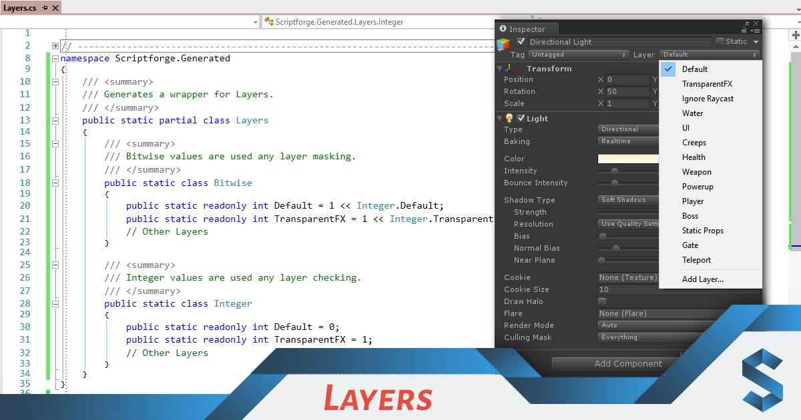
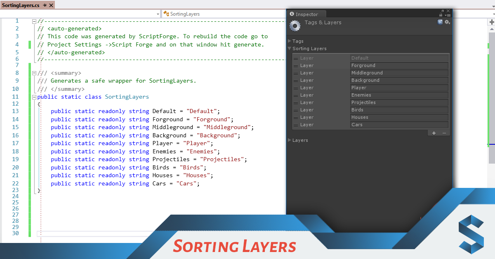
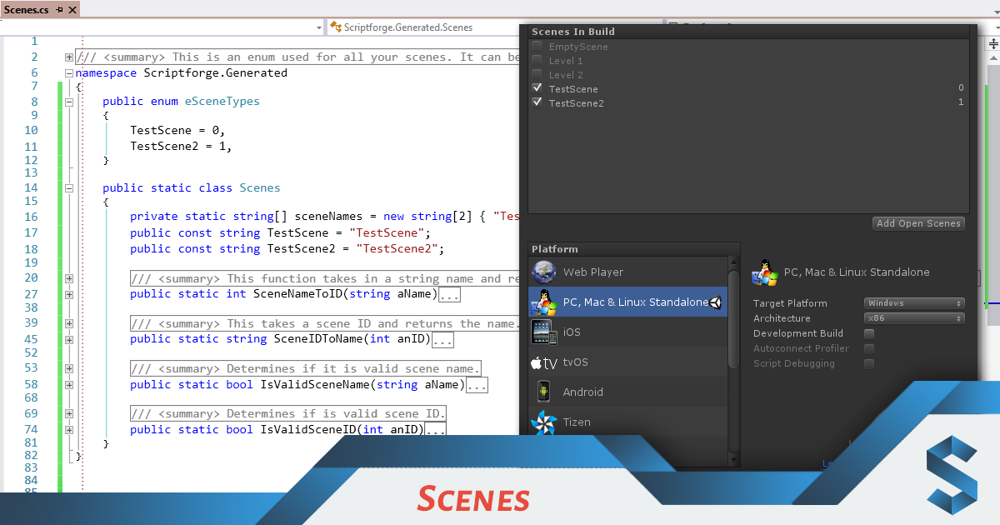
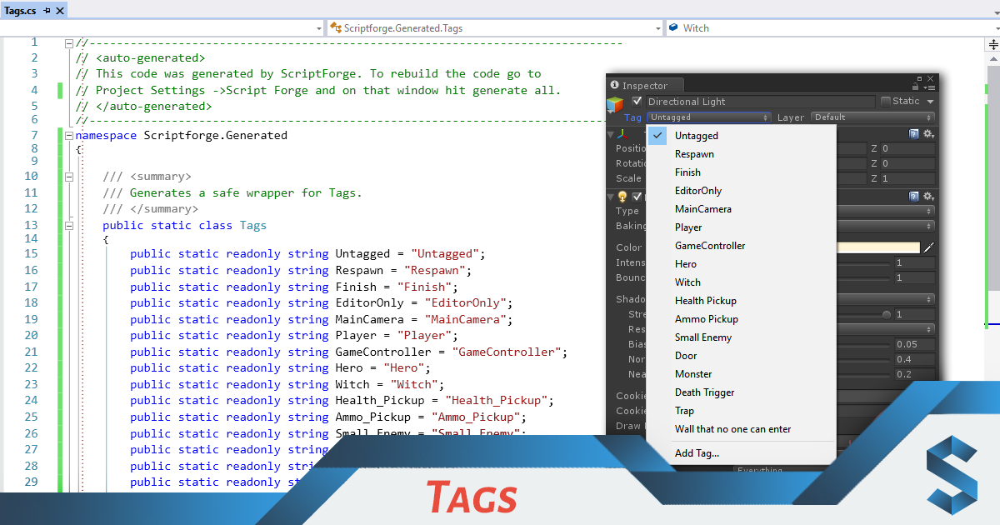
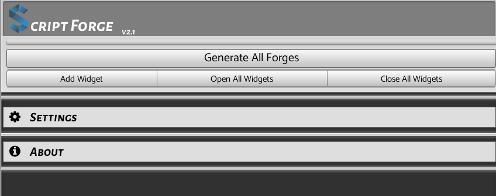
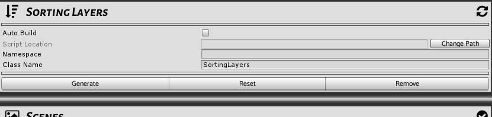
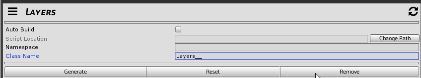

### Quick Note
This is quite an old project but I am still adding to it. Currently the Resources and Animation Widget are not implemented but I am working on that. 
Have any other types of widgets you think would be helpful? Feel free to request it or make your own and I can merge it in. 

# ScriptForge

Scriptforge is a tool used to help you keep your constants up to date. Instead of having to keep track of them by hand they can be generated for you automatically. All you have to do is add the code to your Unity project and go to `Edit/Project Settings/Script FOrge`. These constants can be generated for a range of things. Some example are the Scenes in the build settings, the files in select resource folders, the tags/sorting layers/layers defined in the project. The choice is left to you to choose what you would like to do. 

Can't find a forge creating what you want? Extend the `Widget.cs` class and make your own. Everything is linked with reflection so you don't have to update any other existing code. 

## Widgets
Below is an example of the output of some of the widgets that are in Script Forge.

#### Layers 

#### Sorting Layers 

#### Scenes 

#### Tags 

## Adding a Widget

By default there is always two widgets in view. The first one being the basic settings and the second being about. These are not much use to you. What we will need to do is add a new Widget. To do this click on the `Add Widget` button. 

## Icons

I spent to much time trying to have nice icons in Script Forge. All icons are a made up of [Font Awesome](http://fontawesome.io/) and defined in the matching class `FontAwesomeIcons.cs`.

## Error Handling

##### Input Error
Scriptforge does it's best to let you know what is happening. If you happen to make a mistake (like not setting a file path) the widget will flash red and show an error message at the top. You will also notice our status Icon changes to an `!` to make it clear even if the widget is folded.

##### Automatic Name Cleanup

Many of the fields you see in the inspector are used to generate code directly. This means if you set your class name as something invalid (example `!@#$%^&*`) in it's name this would cause a compile error when the code is generated. Instead of letting you do that all inputs are clean up when you hit enter or click off the fields. As a side note these are custom filed types defined in `EditorGUILayoutEx.cs`.

